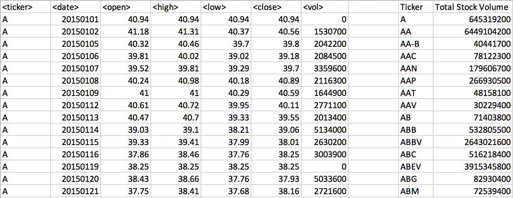

Assignment - The VBA of Wall Street

## Background

This was one of our earliest assignments for the Data Analytics Bootcamp (back in Oct 2018). Going into the bootcamp, I had no knowledge of computing logic; for-loops, conditionals, computer functions, etc. were foreign to me. But one thing I did know was excel. I had used excel so often for work that thinking in rows and columns was familiar!

### Stock market analyst

### Step 1

* Created a script that will loop through each year of stock data and grab the total amount of volume each stock had over the year.

* Displayed the ticker symbol to coincide with the total volume.

### Step 2

* Looped through all the stocks to get the following info:

  * Yearly change from what the stock opened the year at to what the closing price was.

  * The percent change from the what it opened the year at to what it closed.

  * The total Volume of the stock

  * Ticker symbol

* Used conditional formatting to highlight positive change in green and negative change in red.

### Step 3

* Located the stock with the "Greatest % increase", "Greatest % Decrease" and "Greatest total volume".

